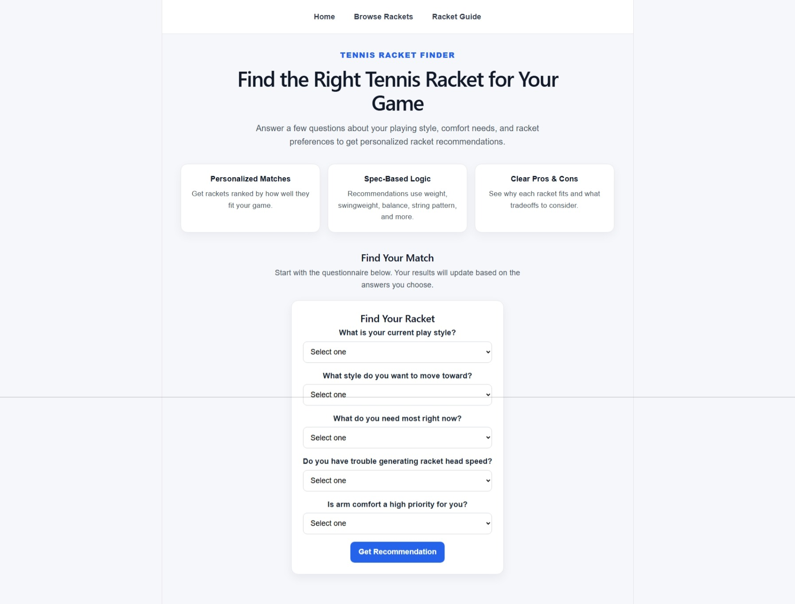
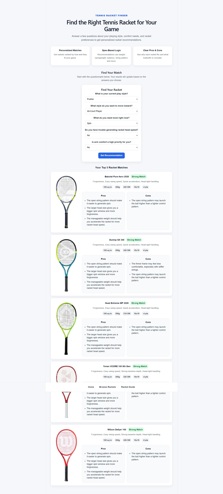
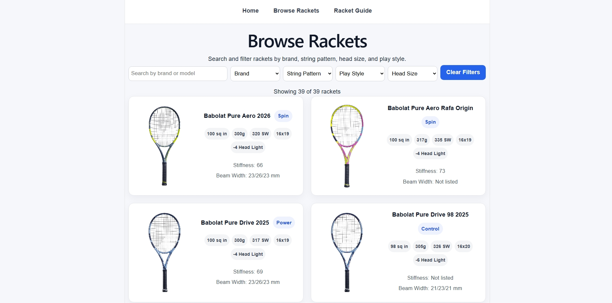
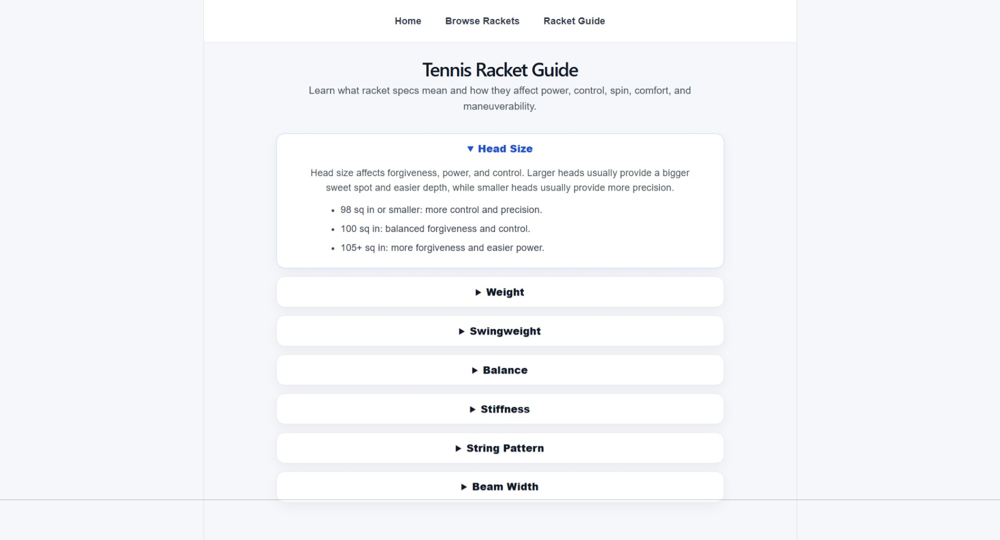

# Tennis Racket Finder

Tennis Racket Finder is a full-stack web app that helps users explore tennis rackets and receive personalized racket recommendations based on their playing style, comfort needs, and racket preferences.

The app uses a React frontend, an Express backend, and a PostgreSQL database of racket specifications. Users can browse rackets, filter by key specs, learn what racket specs mean, and complete a questionnaire to receive ranked racket recommendations with pros, cons, and spec-based explanations.

## Live Demo

Coming soon.

## Screenshots

### Home Page



### Recommendation Results



### Browse Rackets



### Racket Guide



## Features

- Browse a database of tennis rackets
- Search by brand or model
- Filter by brand, string pattern, play style, and head size
- View racket specs including head size, weight, swingweight, balance, stiffness, beam width, string pattern, and play style
- Display racket images from local image paths
- Complete a questionnaire about playing style and racket needs
- Receive top racket recommendations
- View match strength, racket strengths, pros, cons, and key specs
- Learn racket terminology through a dropdown racket guide
- Responsive layout for different screen sizes

## Tech Stack

### Frontend

- React
- Vite
- JavaScript
- React Router
- CSS
- Fetch API

### Backend

- Node.js
- Express.js
- PostgreSQL
- CORS
- dotenv

## Main App Sections

### Home Page

The home page introduces the app and includes the racket recommendation questionnaire.

### Recommendation Engine

The questionnaire asks users about their current playing style, desired style, main racket need, racket head speed, and arm comfort priority. The backend scores rackets based on specs such as weight, swingweight, balance, stiffness, string pattern, head size, and play style.

### Browse Rackets

The browse page displays racket cards with images, specs, and filters. Racket data comes from the PostgreSQL database.

### Racket Guide

The guide page explains important racket specs such as head size, weight, swingweight, balance, stiffness, string pattern, and beam width.

## Current API Routes

| Method | Route | Description |
| ------ | ----- | ----------- |
| GET | `/rackets` | Get all rackets |
| GET | `/rackets/:id` | Get one racket by ID |
| POST | `/rackets` | Add a new racket |
| PATCH | `/rackets/:id` | Update a racket |
| DELETE | `/rackets/:id` | Delete a racket |
| POST | `/recommendations` | Return personalized racket recommendations |

## Example Racket Object

```js
{
  id: 1,
  brand: "Babolat",
  model: "Pure Aero 2026",
  headSize: 100,
  weight: 300,
  swingweight: 320,
  balancePoints: -4,
  stiffness: 66,
  beamWidth: "23/26/23 mm",
  stringPattern: "16x19",
  playStyle: "Spin",
  imageUrl: "/racket-images/babolat-pure-aero-2026.png"
}
```

## How to Run Locally

This project has a backend and frontend in one repository.

### 1. Clone the Repository

```bash
git clone https://github.com/JoshuaGranger-dev/tennis-racket-finder.git
```

### 2. Open the Project Folder

```bash
cd tennis-racket-finder
```

## Backend Setup

From the root project folder:

```bash
cd backend
npm install
npm start
```

The backend should run at:

```txt
http://localhost:5000
```

Test the backend in the browser:

```txt
http://localhost:5000/rackets
```

## Frontend Setup

Open a second terminal from the root project folder:

```bash
cd frontend
npm install
npm run dev
```

The frontend should run at:

```txt
http://localhost:5173
```

## Environment Variables

The backend uses a PostgreSQL database connection string.

Create a `.env` file inside the `backend` folder:

```txt
DATABASE_URL=your_postgresql_connection_string
PORT=5000
```

The `.env` file should not be committed to GitHub.

## Project Structure

```txt
tennis-racket-finder/
  backend/
    routes/
    db.js
    server.js
  frontend/
    public/
      racket-images/
    src/
      components/
      pages/
      App.jsx
      App.css
  screenshots/
  README.md
```

## What I Practiced

- Building a full-stack app with React, Express, and PostgreSQL
- Fetching data from a backend API
- Creating REST API routes
- Connecting frontend filters to database-backed data
- Managing React state
- Passing props between components
- Building controlled forms
- Creating a recommendation questionnaire
- Writing rule-based scoring logic
- Displaying conditional UI based on recommendation results
- Handling loading and error states
- Styling reusable cards and responsive layouts
- Working with Git and GitHub

## Future Improvements

- Deploy the frontend and backend
- Add a live demo link
- Add more racket data and verify all specs
- Add a detailed racket comparison feature
- Add individual racket detail pages
- Add user profiles and saved recommendations
- Add affiliate or “where to buy” links
- Improve recommendation logic with more user inputs
- Eventually add AI-assisted racket explanations and comparisons

## Current Status

The app currently has a working React frontend, Express backend, PostgreSQL database, browseable racket list, filters, racket images, guide page, and a rule-based racket recommendation questionnaire.

The next major step is deployment.
